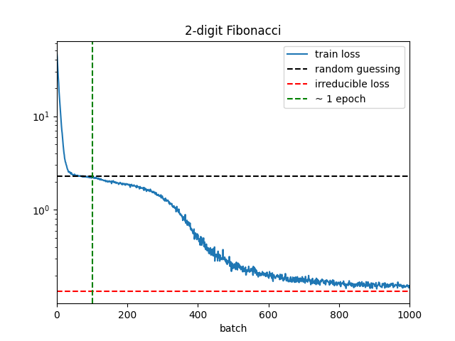
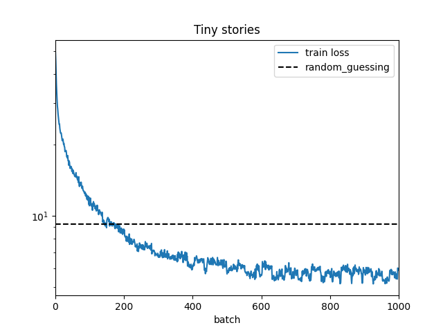
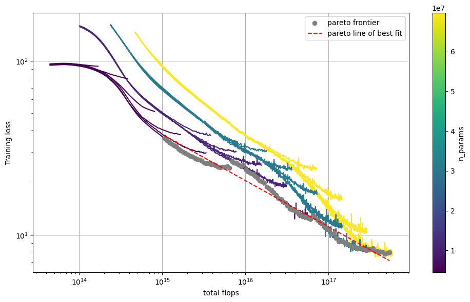
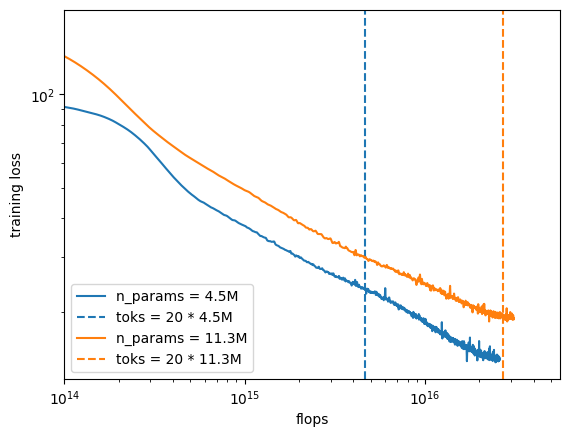
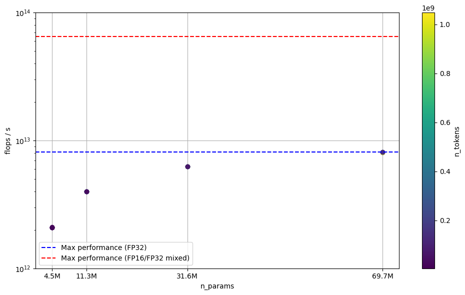
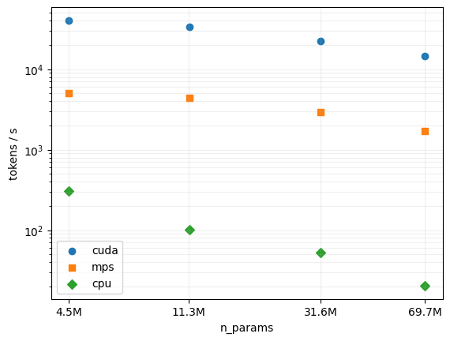

# Scaling Laws

In this repo I train transformer language models at scale and use the results to analyze LLM scaling laws.
For my experiments I use $300 of free trial Google Cloud credits to run LLM training runs on a T4 GPU.
I learned many practical lessons related to training LLMs at scale on a fixed budget.

## Model

I use a standard decoder-only transformer with de-embedding weights tied to the embedding weights in order to reduce the total parameter count.

**Model architecture**: [model.py](src/model.py)

## Hardware accelerators

It's not feasible to train LMs at scale on a CPU.
Therefore I take advantage of available hardware accelerators:
1. Integrated Apple GPU: uses Metal Performance Shaders (MPS), Apple's API for GPU computing
2. CUDA GPU: I use a T4 GPU via a Google Cloud free trial

In practice there are various challenges that arise when training on a GPU.
I discuss some of the lessons I learned below.

## Training

I train models using the AdamW optimizer.
AdamW is just Adam followed by weight decay; it is a common choice of optimizer for LLM training.
The [Chinchilla scaling laws paper](https://arxiv.org/abs/2203.15556), which I take inspiration from, uses AdamW.

I use several tricks to improve performance when training on a GPU:
- In DataLoader use `num_workers=2` and `pin_memory=True` to speed up data loading
- Use Automatic Mixed Precision (AMP): this automatically performs tensor arithmetic in 16-bit precision rather than 32-bit precision whenever possible
- Use GradScaler to prevent underflow of gradients during backprop that might arise due to using AMP

I save model checkpoints throughout training and implement the ability to restart training from a checkpoint.

**Model training**: [train.py](src/train.py)

## Datasets

I work with three datasets:

### Fibonacci
This is a dataset of generalized Fibonacci sequences, intended for preliminary prototyping of the transformer architecture.
Each integer sequence is defined by two parameters, `n_seeds` and `max_int`.
The first `n_seeds` integers in the sequence are uniformly sampled from `[0,1,...,max_int]`, and subsequent integers are defined by the sum of the previous `n_seeds` integers, modulo `max_int`.
Low next token prediction loss on this dataset requires a transformer to be able to focus its attention on the previous `n_seeds` tokens, so it is useful for testing whether the attention mechanism works.

**Create dataset**: [`scripts/create_fibonacci_data.py`](scripts/create_fibonacci_data.py)  
**Dataset**: [`data/fibonacci`](data/fibonacci/).

### Tiny Stories
Dataset of synthetically generated short stories; see [paper](https://arxiv.org/abs/2305.07759) and [huggingface repo](https://huggingface.co/datasets/roneneldan/TinyStories).
Has a small vocab size (10k) and is very clean relative to real-world datasets.
I use this dataset for quick prototyping of things like model checkpointing, training on accelerators, etc. 

**Create dataset**: [`scripts/create_tiny_stories_data.py`](scripts/create_fibonacci_data.py)  
**Dataset**:[`data/tiny_stories`](data/tiny_stories/).

### Slim Pajama
This is an 895GB natural language dataset from Cerebras; see [blog](https://www.cerebras.net/blog/slimpajama-a-627b-token-cleaned-and-deduplicated-version-of-redpajama)
and [huggingface repo](https://huggingface.co/datasets/cerebras/SlimPajama-627B).
The dataset is not tokenized - I tokenize it using the [LLaMA-30B](https://huggingface.co/huggyllama/llama-30b)'s tokenizer. 
I use this dataset for my scaling law experiments.

**Create dataset**: [`scripts/create_slim_pajama_data.py`](scripts/create_slim_pajama_data.py)  
**Dataset**:[`data/slim_pajama`](data/slim_pajama).

## Preliminary experiments

### Fibonacci
I train a 150k parameter model on Fibonacci sequences of length 32, with 2 and 3 seeds, and addition modulo 10.
Training results for the 2-seed case are shown:

Here each batch is a single sequence.
With 1000 batches the model is able to reduce its loss nearly to the irreducable loss threshold (the unavoidable loss due to the random seeds).
However improvements beyond random guessing only appear after ~100 batches, which corresponds exactly to the number of different sequences with 2 seeds and 10 digits.
Therefore the low training loss is likely due to the model memorizing the sequences and not due to generalization ability (we could verify this using a held out test set).

**Training script**: [`scripts/train_fibonacci.py`](scripts/train_fibonacci.py)

### Tiny Stories

Next I train a 789k parameter model on 2M tokens from the Tiny Stories dataset.
The training curve is:

Since the full dataset contains more than 2M tokens, we never repeat training data, and therefore the training loss is indicative of generalization.

**Training script**: [`scripts/train_tiny_stories.py`](scripts/train_tiny_stories.py)  
**Results**: [`results/tiny_stories`](results/tiny_stories/)

## Main experiments

For my main experiments I train models at various levels of scale on the Slim Pajama dataset.

**Training script**: [`scripts/train_slim_pajama.py`](scripts/train_slim_pajama.py)  
**Results**: [`results/slim_pajama`](results/slim_pajama/)  
**Analysis**: [`analysis.ipynb`](analysis.ipynb)

Results are discussed below, after discussing hyperparameters.

## Hyperparameters

There are ~10 hyperparameters that define a vanilla transformer's architecture and training setup.
Even a crude study of the full hyperparameter space would require thousands of training runs.
Instead, basic scaling law experiments typically focus on the effects of only two hyperparameters: the total number of parameters of the model and the total number of training tokens. 
The remaining hyperparameters must be set in some principled way.
Here I discuss how I chose all the hyperparameters for my experiments.

### Architecture hyperparameters

#### `d_model`

This is effectively the single free "architecture" parameter which determines all other architecture parameters.
Preliminary experiments showed that `d_model` as high as 1280 could fit on the T4 GPU, and that this model could be optimally trained (according to the Chinchilla scaling laws) within my $300 Google Cloud budget, all the while leaving enough compute for training smaller models for the purposes of analyzing scaling trends.
However the prototyping phase ended up using more compute than I anticipated, so I didn't make it to models of this size.
In the end I varied `d_model` over the values 128, 256, 448, 640.

#### `vocab_size`

I use a vocab size of 30k, which is on the lower end of the standard range for LLMs.
I stick to the lower end of the range because my models are fairly small LLMs, and I wanted to reduce the relative fraction of embedding parameters.
This is why I used the LLaMA-30B tokenizer: it had the desired vocab size.

#### `n_heads`

I pick this so that `d_model / n_heads = 64`, which is a fairly standard choice.

#### `n_layers`

For simplicity I set `n_layers = n_heads`, which is similar to the Chinchilla paper (see table A4 in the paper).

#### `n_params`

Fixing `d_model`, `vocab_size`, `n_heads` and `n_layers` determines `n_params`.
I train models with 4.5M, 11.3M, 31.6M, and 69.7M parameters.

### Training hyperparameters

#### `n_tokens`

The Chinchilla paper showed that the optimal ratio of tokens to parameters when training transformer LLMs is ~20.
To verify this I train each model on 4 or 5 token to parameter ratios ranging from 2 to ~30.
The exception is my largest model, which due to insufficient compute I only trained to a ratio of ~15.

#### `seq_len` and `batch_size`

Here `seq_len` is the number of tokens in a sequence and `batch_size` the number of sequences in a batch.
The most *token* efficient way to train LLMs is one token per batch (with a suitably small learning rate), but this is obviously extremely *time* inefficient.
Instead, batch sizes of millions of tokens (and larger learning rates) are typically used to train LLMs.
This improves the time efficiency by millions of times, while minimally sacrificing token efficiency (see [here](https://arxiv.org/abs/1812.06162)).

In my case however I was limited by GPU memory. 
Preliminary experiments showed that for the biggest model I intended to train (485M parameters), the maximum tokens per batch that the GPU could support was ~4096, split up as `seq_len = 256` and `batch_size = 16`.
Because attention activations (one of the contributors to GPU memory usage) scale as `batch_size * seq_len ** 2` and other activations only scale as `batch_size * seq_len`, the tokens per batch can be slightly increased by decreasing `seq_len` and increasing `batch_size`.
Nevertheless I chose to keep `seq_len` at 256 so that my trained models can have a context window that can fit most paragraphs.
For simplicity I kept `seq_len = 256` and `batch_size = 16` even when training smaller models.

#### `total_batches`

The total number of batches is fixed once `n_tokens`, `seq_len`, and `batch_size` are fixed.
The biggest model I intended to train had 485M parameters, and Chinchilla scaling suggests that optimal training of this model requires ~10B tokens.
With 4096 tokens per batch this is ~2.5M batches.
Preliminary experiments showed that on the T4 GPU each batch takes ~1s so this would take about a month of runtime.
This is reasonable as the T4 costs ~$7/day and I had $300 in cloud credits, which amounts to ~40 days of T4 compute.

#### `lr`

Decreasing the learning rate during training is an effective strategy when training LLMs.
A typical decrease factor is 10, which is what I use.
The Chinchilla paper showed that when using a cosine annealing schedule the optimal annealing period is the full training horizon (over the entire training run the lr decreases from the initial lr to 1/10 of the initial lr via a half cosine period).
I follow this prescription.

The initial lr in the Chinchilla paper is $2\times 10^{-4}$ for their smallest model (73M params), so I use this as a reference.
However the batch size used by them is 0.5M tokens, whereas my batch size is only 4096 tokens.
Decreasing the batch size should be accompanied by a linear decrease in the learning rate, so I scale the Chinchilla lr by a factor of 4096/0.5M, resulting in an initial lr of $1.6\times 10^{-6}$.

#### `p_drop`

I intended to set the dropout rate to a typical value of 0.1, but I forgot, so it defaulted to 0 (no dropout).
It's unlikely that this had much effect on my results.

## Results: scaling laws

I perform 20 training runs on 4 model sizes, ranging from 4.5M to 69.7M parameters, and trained on varying number of tokens, ranging from 4M tokens for the smallest training run on the smallest model, to 1.0B tokens for the largest training run on the largest model.

### Loss vs flops

I plot the 20 training loss curves (Gaussian smoothed) as a function of flops:

The key observation is that the pareto frontier of the loss curves, highlighted in grey, roughly follows a straight line on the log-log plot.
The line of best fit is
$$
\log{(\text{loss})} = -0.265 \log{(\text{flops})} + 18.44,
$$
and is shown in red.
From this we can extrapolate the pareto training loss to higher flop values:
| flops | extrapolated pareto loss | 
|-------|--------------------------|
| 1e19  | 3.30                     |
| 1e20  | 1.79                     |
| 1e21  | 0.97                     |
| 1e22  | 0.53                     |

We can compare these predictions to the actual losses achieved reported in the Chinchilla paper (Fig 2).
The extrapolated loss at $10^19$ flops is roughly what is achieved in practice, while the predicted losses at higher flop values are consistently lower than the actual achieved losses.
This is likely due to the well-known deviation from a perfectly linear relationship between log-loss and log-flops which must exist due to a non-zero irreducible loss / Bayes error / entropy of natural language that necessarily lower bounds the performance of any language model.

### Optimal scaling of model size and training data

The main practical benefit of LLM scaling laws is that they allow practitioners to predict the optimal balance between model size and data size for a given compute budget.
The Chinchilla paper showed that this optimal balance is achieved when the token to parameter ratio is ~20.
The main goal of this project was to confirm this result, or at least obtain a different optimal ratio.
Unfortunately I wasn't able to do either of these things.

To understand why not, notice from the above plot of loss versus flops that at any given flop value *the smallest trained model has the lowest loss*.
In other words there is *no crossover* between training curves corresponding to different sized models.
To see this more clearly here is a plot of only two training runs:

The blue curve corresponds to a 4.5M parameter model and the orange curve to a 11.3M parameter model. 
The dashed lines indicate the number of flops that Chinchilla predicts are optimal in training models of these sizes.
Indeed there is no crossover between the two loss curves.

This is in contrast to the Chinchilla analysis, which implies that such a crossover should occur between the two dashed lines. 
What's worse, the loss curves don't even seem like they're approaching one another, and so it doesn't seem like a crossover would occur if they were extended by further training.
This is counter to common sense: training optimally on a large number of tokens should require a large model.

Something is therefore clearly wrong with my methodology. 
In hindsight, my guess is that the issue stems from my model parameter initializations. 
I used a standard initialization approach in which weight matrices of shape $n_\text{in}$ by $n_\text{out}$ neurons are initialized to be of a scale $1 / \sqrt{n_\text{in}}$.
However the Chinchilla models use a different ["Maximal Update Parameterization" (MUP)](https://blog.eleuther.ai/mutransfer/#footnotes) initialization approach. 

MUP is very useful because it ensures that hyperparameters optimized for a small "base" model remain optimal for a larger model.
The trick however is that regular trainable parameters must be initialized in a non-trivial way that depends on the ratio of the large model scale to the base scale.
This is different from the standard parameter initialization that I used, and is likely the reason that I'm unable to reproduce the Chinchilla results.

## Results: benchmarking hardware accelerators

I timed each of my training runs - let's analyze this timing data.

### T4 Performance

First consider the training runs performed on the Google Cloud T4 GPU.
Here are the timing results:

First, notice that for a given model size the performance of the GPU, measured in flops/s, isn't affected by the length of the training run, i.e. the number of tokens. 
This of course makes sense as the GPU doesn't speed up or slow down with more batches.

Next we see that larger models are able to get better performance out of the GPU.
This also makes sense since training larger models requires multiplying larger matrices and so it takes better advantage of the parallelism offered by the GPU.

Finally the T4 GPU has a nominal max perfomance of 8.1 TFLOPS ($10^{12}$ flops/s) when performing float-32 arithmetic, and 65 TFLOPS when performing mixed precision arithmetic.
Interestingly the largest model achieves a performance of almost exactly 8.1 TFLOPS.
Although it is enticing to say that we have obtained maximum usage out of the T4, this is not the case, and is only a conincidence.
Remember that we are using automatic mixed precision (AMP), which has a theoretical max performance of 65 TFLOPS. 
We are far from this theoretical maximum, but at least we can be fairly certain that the AMP is working; if it weren't we would be achieving 100% GPU usage, which seems very unlikely.

### CPU vs MPS vs T4

Finally we can compare speed of training on a CPU (16GB Macbook Pro M4) to a Mac integrated GPU (accessed via the MPS framework) to the T4 GPU (CUDA framework).
The results are:

MPS is 20-180 times faster than a CPU, with the difference being more pronounced for larger models.
Meanwhile the T4 is consistently about 7 times faster than MPS. 

## Things to improve

There are several things I'd like to improve in the future:

1. **Use gradient checkpointing**---This saves memory by recomputing activations during the backward pass.
Naively it would require more compute, but if the extra available memory allowed for an increase of batch size then ultimately it might reduce compute.

2. **Use maximal update parameterization (MPS)**---MPS ensures optimal hyperparameters of small models remain optimal for large models, and so it greatly fascilitates compute optimal training. 
As discussed above my inability to reproduce the Chinchilla results is likely due to me using standard parameter initialization rather than MPS.

3. **Train larger models**---My estimates show that it would've been feasible to optimally train up to a model size of ~500M parameters given my T4 compute budget.
But a lot of my budget was used in prototyping, so my largest model was only 70M parameters.
I'd like to improve upon this.

4. **Train more optimally**---My benchmarking results show that even my biggest model is far from using the T4 GPU at it's maximum (mixed precision) flop rate.
I expect it's difficult / impossible to achieve the max rate in practice, but there is surely room for improvement.

5. **Scaling/emergence of downstream capabilities**---Scaling laws usually focus on the trend of training loss versus flops / parameters / tokens because this trend is very clean (almost linear on a log-log plot).
But training loss is often a poor proxy for performance on specific downstream tasks.
In fact performance on specific tasks often doesn't follow a clean scaling law, but instead it's often the case that capabilities suddenly emerge at a particular (a priori unknown) scale.
In the future I'd like to investigate this for capabilities that are known to emerge at the 100M-1B parameter model scales.