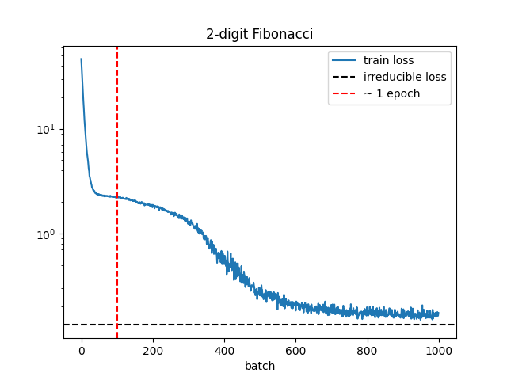

# Scaling Laws

In this repo I train transformer based language models at scale and use the results to analyze LLM scaling laws.
For my experiments I use the $300 of free trial Google Cloud credits to run my experiments on a T4 GPU.
I learned many practical lessons related to training LLMs at scale on a fixed budget.

## Model

My model architecture is defined in [model.py](src/model.py).
I use a standard decoder-only transformer and the de-embedding weights to the embedding weights in order to reduce the total parameter count of the model.

## Hardware accelerators

It is not feasible to train language models at scale on a CPU.
Therefore I write my code to take advantage of available hardware accelerators.
I make use of two types of accelerators:
1. Metal Performance Shaders (MPS): available on newer Mac computers
2. GPU: we use a T4 GPU via a Google Cloud free trial

In practice there are various new challenges that arise when training on an accelerator, in particular on a GPU.
I will discuss some of these nuances below.

## Training

I train the models using the AdamW optimizer (see [train.py](src/train.py)).
AdamW is just Adam followed by weight decay of all the weights by the same factor, and it is a common choice when training LLMs.
The [Chinchilla scaling laws paper](https://arxiv.org/abs/2203.15556), which I take inspiration from, uses AdamW.

To improve performance when training on a GPU, I do the following:
- In DataLoader use `num_workers=2` and `pin_memory=True` to speed up data loading
- Use Automatic Mixed Precision (AMP): this automatically performs tensor arithmetic in 16-bit precision rather than 32-bit precision whenever possible
- Use GradScaler to prevent underflow of gradients during backprop that might arise due to using AMP

I save model checkpoints throughout training and implement the ability to restart training from a checkpoint.

## Datasets

I work with three datasets:

### Fibonacci
This is a dataset of generalized Fibonacci sequences.
Each integer sequence is defined by two parameters, `n_seeds` and `max_int`.
The first `n_seeds` integers in the sequence are uniformly sampled from [0,1,...,`max_int`], and subsequent integers are defined by the sum of the previous `n_seeds` integers, modulo `max_int`.
Success on this dataset requires a transformer to be able to focus its attention on the previous `n_seeds` tokens, so it is useful for testing whether the attention mechanism works.

Purpose:
- Preliminary testing of transformer architecture

Files:
- Create dataset: [`scripts/create_fibonacci_data.py`](scripts/create_fibonacci_data.py)
- Dataset: [`data/fibonacci`](data/fibonacci/).

### Tiny Stories
Dataset of synthetically generated short stories; see [paper](https://arxiv.org/abs/2305.07759) and [huggingface repo](https://huggingface.co/datasets/roneneldan/TinyStories).
Has a small vocab size (10k) and is very clean relative to real-world datasets.

Purpose:
- Prototyping: model checkpointing, training on accelerators, etc. 

Files:
- Create dataset: [`scripts/create_tiny_stories_data.py`](scripts/create_fibonacci_data.py)
- Dataset:[`data/tiny_stories`](data/tiny_stories/).

### Slim Pajama
895GB natural language dataset from Cerebras; see [blog](https://www.cerebras.net/blog/slimpajama-a-627b-token-cleaned-and-deduplicated-version-of-redpajama)
and [huggingface repo](https://huggingface.co/datasets/cerebras/SlimPajama-627B).
The dataset is not tokenized - I tokenize it using the [LLaMA-30B](https://huggingface.co/huggyllama/llama-30b)'s tokenizer.

Purpose:
- Scaling law experiments

Files:
- Create dataset: [`scripts/create_slim_pajama_data.py`](scripts/create_slim_pajama_data.py)
- Dataset:[`data/slim_pajama`](data/slim_pajama).

## Preliminary experiments

### Fibonacci
I train a 150k parameter model on Fibonacci sequences of length 32, with 2 and 3 seeds, with addition modulo 10.
Training results for the 2 seed case are shown:

Each batch is a single sequence.
With 1000 batches the model is able to reduce its loss nearly to the irreducable loss threshold (the unavoidable loss due to the random seeds).
However improvements beyond random guessing begin after ~100 batches, which corresponds exactly to the number of different sequences with 2 seeds and 10 digits.
Therefore the low training loss is likely due to the models memorizing the sequences and not due to generalization ability.
We could easily verify this using a held out test set, but let's instead move on to training on natural language.

Files:
- Training script: [`scripts/train_fibonacci.py`](scripts/train_fibonacci.py)
- Results: [plots/2_digit_fibonacci.png](plots/2_digit_fibonacci.png) and [plots/3_digit_fibonacci.png](plots/3_digit_fibonacci.png)

### Tiny Stories
Next I train a 789k parameter model on 2M tokens from the Tiny Stories dataset.
The training curve is as follows:

Since the full dataset contains more than 2M tokens, we never repeat training data, and therefore the training loss is indicative of generalization.

Files:
- Training script: [`scripts/train_tiny_stories.py`](scripts/train_tiny_stories.py)
- Results: [`results/tiny_stories`](results/tiny_stories/)

## Main experiments

My main experiments consisted of training models of various sizes on varying number of tokens from the Slim Pajama dataset.
The goal was to obtain scaling law plots like those in the [Chinchilla paper](https://arxiv.org/abs/2203.15556).

Files:
- Training script: [`scripts/train_slim_pajama.py`](scripts/train_slim_pajama.py)
- Results: [`results/slim_pajama`](results/slim_pajama/)

### Hyperparameters

There are ~10 hyperparameters that define a vanilla transformer's architecture and training setup.
Therefore even a very crude study of the full hyperparameter space would require many thousands of training runs.
Instead, basic scaling law experiments typically focus on the effects of only two hyperparameters: the total number of parameters of the model and the total number of training tokens. 
The remaining hyperparameters must be set in some principled way.
Here I discuss how I chose all the hyperparameters for my experiments.

#### Architecture hyperparameters

##### `d_model`

`d_model` is effectively the single free "architecture" parameter that ultimately determines all of the other architecture parameters, including `n_params`.
Preliminary experiments showed that `d_model` as high as 1280 could fit on the T4, and that this model could be optimally trained (according to the Chinchilla scaling laws) within my $300 Google Cloud budget, all the while leaving enough compute for training smaller models for the purposes of analyzing scaling trends.
However the learning / debugging / prototyping phase ended up using more compute than anticipated, and in the end I only had enough compute to train up to a `d_model = 640`.
I ended up varying `d_model` over the values 128, 256, 448, 640.

##### `vocab_size`

I use a vocab size of 30k, which is on the lower end of the standard range for LLMs (e.g. GPT-3 had a vocab size of ~50k).
I stick to the lower end of the range because my models are fairly small LLMs, and I wanted to reduce the relative fraction of embedding parameters.
This is why I ended up using the LLaMA-30B tokenizer: it had the desired vocab size.

##### `n_heads`

I pick `n_heads` so that `d_model / n_heads = 64`, which is a fairly standard choice.

##### `n_layers`

For simplicity I pick `n_layers = `n_heads`, which is roughly the trend observed in the smaller models from the Chinchilla paper (see table A4 in the paper).

##### `n_params`

Fixing `d_model`, `vocab_size`, `n_heads` and `n_layers` determines `n_params`.
I train models with 4.5M, 11.3M, 31.6M, and 69.7M parameters.

#### Training hyperparameters

##### `n_tokens`

The Chinchilla paper showed that the optimal ratio of tokens to parameters when training transformer LLMs is ~20.
To verify this I train each model on 4 or 5 token to parameter ratios ranging from ~2 to ~30.
The exception is my largest model, which due to insufficient compute I only trained to a ratio `n_tokens / n_params ~ 15`.

##### `seq_len` and `batch_size`

The number of tokens in a batch is `seq_len * batch_size`, where `batch_size` is the number of sequences in a batch.
The most *token* efficient way to train LLMs is one token per batch (with a suitably small learning rate), but this is obviously extremely *time* inefficient.
Instead, batch sizes of millions of tokens (with larger learning rates) are typically used to train frontier LLMs.
This improves the time efficiency by millions of times, while minimally sacrificing token efficiency (see [here](https://arxiv.org/abs/1812.06162)).
In my case however I was limited by GPU memory. 
Preliminary experiments showed that for the biggest model I intended to train (485M parameters), the maximum tokens per batch that the GPU could support was ~4096, split up as `seq_len = 256` and `batch_size = 16`.
Because attention activations (one of the contributors to GPU memory usage) scale as `batch_size * seq_len ** 2` and other activations only scale as `batch_size * seq_len`, the tokens per batch can be slightly increased by decreasing `seq_len` and increasing `batch_size`, but I chose to keep `seq_len` at 256 so that my trained models can have a context window that can fit a paragraph.
For simplicity I kept `seq_len = 256` and `batch_size = 16` even for the smaller models.

##### `total_batches`

The total number of batches fixed as `total_batches = n_tokens / (seq_len * batch_size)`.
The biggest model I intended to train had 485M parameters, and Chinchilla scaling suggests that optimal training of this model requires ~10B tokens.
With 4096 tokens per batch this is ~2.5M batches.
Preliminary experiments showed that on the T4 GPU each batch takes ~1s so this would take about a month of runtime, which is reasonable: 
the T4 costs ~$7/day and I had $300 in cloud credits, which amounts to ~40 days of T4 compute.

##### `lr`

Decreasing the learning rate during training is known to be effective when training LLMs.
A typical decrease factor is 10, which is what I use.
The Chinchilla paper famously showed that when using a cosine annealing schedule, the optimal annealing period is the full training horizon, 
i.e. over the entire training run the lr decreases from the initial lr to 1/10 of the initial lr via a half cosine period.
I follow this prescription.
The initial lr in the Chinchilla paper is $2\times 10^{-4}$ for their smallest model (73M params), so I use this as a reference.
However the batch size used by them is 0.5M tokens, whereas my batch size is only 4096 tokens.
As explained [here](https://arxiv.org/abs/1812.06162) decreasing the batch size should be accompanied by a linear decrease in the learning rate.
Therefore I scale the Chinchilla lr by a factor of 4096/0.5M, resulting in an initial lr of $1.6\times 10^{-6}$.

##### `p_drop`

I intended to set the dropout rate to `0.1`, which is typical, but I forgot, so it defaulted to 0 (no dropout).
It's unlikely that this had much effect on my results.

### Results: scaling laws

### Results: benchmarking hardware accelerators

## Things to improve
- gradient checkpointing to save memory
- maximal update parameterization to ensure optimal hyperparameters

## Hyperparameters

Experiments on Google Colab T4 GPU:

| params | n_layers | d_model | batch_size | seq_len | can run? | iter/s |
|--------|----------|---------|------------|---------|----------|--------|
| 262M   | 20       | 1024    | 32         | 128     | YES      | 1.7    |
| 485M   | 24       | 1280    | 32         | 128     | YES      | 1.0    |
| 585M   | 24       | 1408    | 32         | 128     | NO       | N/A    |

So the largest model we can run is roughly 485M params. 
Let's check if this makes sense.
This model is 1.94 GB (4 bytes / parameter). 
During LLM training the main contributions to GPU usage are:
- model: 1.94 GB
- gradients: same as model (1.94 GB)
- Adam optimizer: 2x model size (3.88 GB) 
- Attention activations: n_layers * batch_size * seq_len^2 numbers at 2 byte precision (0.03 GB)
- Other activations: O(10) * n_layers * n_tokens * d_model numbers at 2 byte precision (~1.3 GB)

This adds up to ~9 GB. 
This is reasonable given that the T4 has 16 GB of VRAM, 
that some of it has to go towards overheads costs,
and that we probably aren't pushing it to it's absolute limit.
Note that although the attention activation memory footprint grows quadratically with the sequence length
and can therefore dominate, in our case the sequence length is fairly small (128),
so this part of the memory footprint is minor.

Chinchilla taught us that the number of tokens for compute optimal training should be
roughly 20x the model size.
So for the 485M model we should train on ~10B tokens.
Each batch has 32 * 128 = 4096 tokens so this amounts to ~2.5M batches.
Each batch takes ~1s so this would take about a month of runtime, which is reasonable: 
the T4 costs ~$7/day and Google gives $300 in credits, which amounts to ~40 days of continuous runtime.

The fact that we are saturating both our GPU memory and making full use of our GPU hours is a good sign
that we have made good decisions for our hyperparameters.
However there is one degree of freedom that we can still tune, without much affect on the memory or runtime:
we can change batch_size and seq_len while keeping their product (n_tokens) fixed.
This will affect the memory footprint of the attention activations, and so it is generally not a luxery one has,
but because our attention activations are relatively small we can get away with it (to an extent).
The smart thing to do therefore is to increase seq_len at the expense of batch_size, 
because this will, essentially for free, result in a model with a larger context window.
Indeed we find that decreasing the batch_size to 16 while increasing seq_len to 256 still allows the training
to fit on the GPU and it has no affect on the runtime (still 1.0 s/batch).
Going to batch_size = 8 and seq_len = 512 however is too much; the training run crashes due to insufficient memory,
presumably because the minor increase in attention activation memory pushes us past the memory capacity of the GPU.

### Learning rate

In the Chinchilla scaling experiments they use a learning rate of 2e-4 for their smallest model (73M parameters) and 1.25e-4 for their largest model (6.8B parameters).
My models will be on the smaller end of this range, so I will use the 2e-4 as a reference.
However the batch size used to train the Chinchilla models is 0.5M tokens, whereas I will use a much smaller batch size of 4096 tokens, to save GPU memory (see discussion above).
Therefore I will scale the learning rate by a factor of 4096/0.5M, giving a batch size of 1.6e-6.

This lr seems to give worse results than bigger lrs.
I think the reason is that Chinchilla used Maximal Update Parameterization while I'm using Standard Parameterization, and therefore using their lr to inform my lr doesn't make sense.

### Experiments with batch size

| params | n_layers | d_model | bs  | seq_len | tokens | VRAM (max 15360 MiB) | iter/s |
|--------|----------|---------|-----|---------|--------|----------------------|--------|
| 14M    | 8        | 256     | 16  | 256     | 4096   | 2515 MiB             | 7.0    |
| 14M    | 8        | 256     | 32  | 256     | 8192   | 5673 MiB             | 4.5    |
| 14M    | 8        | 256     | 16  | 512     | 8192   | 5107 MiB             | 3.9    |
| 14M    | 8        | 256     | 64  | 256     | 16384  | 9059 MiB             | 2.5    |
| 14M    | 8        | 256     | 32  | 512     | 16384  | 9969 MiB             | 2.1    |
| 14M    | 8        | 256     | 16  | 1024    | 16384  | 11571 MiB            | 1.6    |
| 14M    | 8        | 256     | 128 | 256     | 32768  | Out of memory        | N/A    |